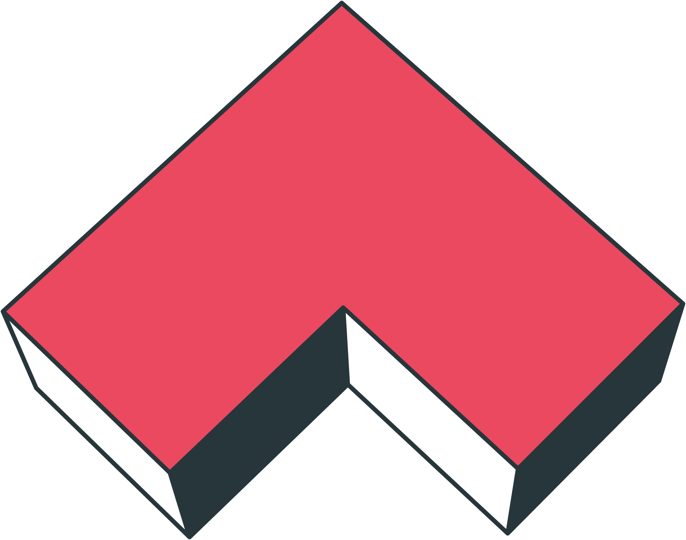

# 🖼 Branding

This section is your guide to the Angle brand, including logos, icons, and images to be used when writing articles or creating designs and animations about Angle.


Angle is still a new piece in the ecosystem, but we need to make sure the image remains consistent across platforms. If you have any suggestions, want to create artworks or think with the community about do's and don'ts for the Angle brand, please join the [#🎨design](https://discord.gg/qaVN8Bjnpn) channel of our Discord community server!


## Color Palette

Angle color palette is composed of 5 colors and their associated gradients:

* Spring Rain: #99B998
* Peach: #FDCEAA
* Light Coral: #F4837D
* Dark Pink: #EB4960
* Oxford Blue: #27363B

You can find the complete color palette in this pdf:

## Icons

You can download [this zip file](https://github.com/AngleProtocol/angle-docs/tree/c3080d47c5588a6b7b2f2055f8328ef206b5b1d0/.gitbook/assets/logo-icons.zip), where you will find all the icons and logos related to Angle.

They look like this:

 
