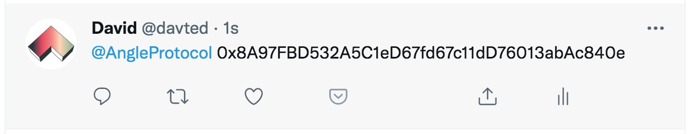

# 🧪 Rinkeby testnet guide

## Testnet Users

To use [the protocol](https://app.angle.money) in testnet, you need to connect to the Rinkeby network.

On Angle testnet, you will need ETH to pay for gas, and wETH, wBTC, USDC or DAI to use the app. We built a faucet at [app.angle.money/\#/faucet](https://app.angle.money/#/faucet) so you can receive these tokens quickly!

Here are the steps to follow:

1. Post a tweet mentionning [@AngleProtocol](https://twitter.com/AngleProtocol/) and containing your Ethereum address.

   

2. Go to [app.angle.money/\#/faucet](https://app.angle.money/#/faucet), paste the link of your tweet, and click on **Get Tokens**.
3. After a few minutes, you should receive some ETH, wETH, wBTC, USDC, and DAI.

You should now be all set up to start testing Angle on [app.angle.money](https://app.angle.money/#/faucet)! Next, head to our main user guides to see how to use the protocol.




In case our faucet is down, you can also follow [this](https://teller.gitbook.io/teller-1/testing-guide/getting-testnet-tokens-rinkeby) guide.

