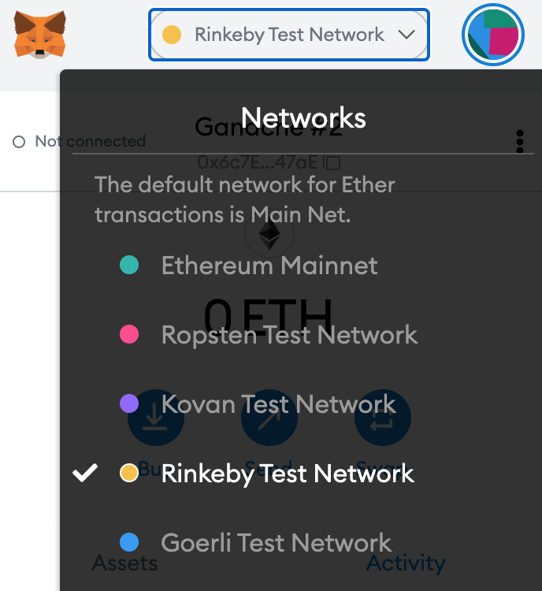

# 📔 User Guides









## Testnet Users

To use the protocol in testnet, you need to connect to the Rinkeby network.

Once you are connected to Rinkeby, you can get testnet ETH, USDC and DAI by following the instructions below\*:

1. Go to your preferred social media platform, and write a public tweet or post with your Ethereum wallet address.

2. Open a new tab and go to https://faucet.rinkeby.io/, enter the link to your post and select the amount of test ETH you would like. You will need some to pay for gas.

3. On Angle, you will need to use wETH, wBTC, USDC or DAI.

To wrap your ETH, you can go to [Uniswap](https://app.uniswap.org) or any other DEX working on Rinkeby. You can also get wBTC from one of these exchanges.

Then, if you want to get USDC or DAI, go to https://app.compound.finance/, and connect with Metamask on Rinkeby. If you click on any Supply Markets coin, you will see a FAUCET button at the bottom.

5. Click on the FAUCET button and confirm the transaction to receive Rinkeby testnet tokens you can use on Angle.

You should now be all set up to start testing Angle on [app.angle.money](https://app.angle.money)!

\*guide from [Teller](https://teller.gitbook.io/teller-1/testing-guide/getting-testnet-tokens-rinkeby)
