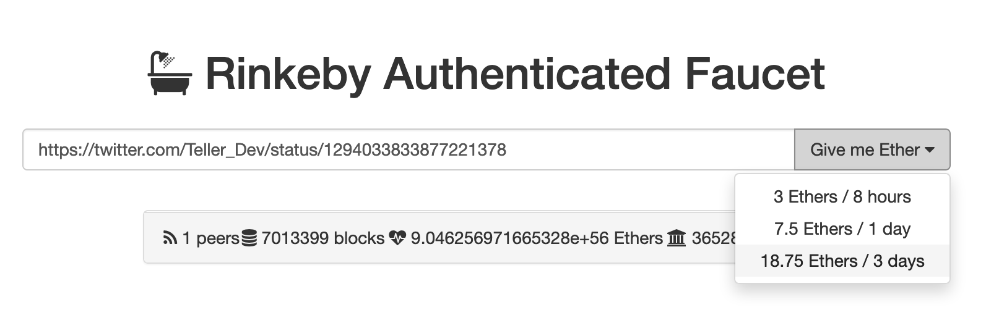

# 📔 User Guides

## Testnet Users

To use [the protocol](https://app.angle.money) in testnet, you need to connect to the Rinkeby network.

On Angle testnet, you will need to use wETH, wBTC, USDC or DAI. To get these collateral types on Rinkeby, you can follow the instructions below:

1. Go to your preferred social media platform, and write a public tweet or post with your Ethereum wallet address.

2. Open a new tab and go to this [faucet](https://faucet.rinkeby.io/), enter the link to your post and select the amount of test ETH you would like. You will need some to pay for gas.

3. To wrap your ETH and get wETH, you can go to [Uniswap](https://app.uniswap.org) or any other DEX working on Rinkeby. You can also get wBTC from one of these exchanges.

4. Then, if you want to get USDC or DAI, go to [Compound](https://app.compound.finance/), and connect with Metamask on Rinkeby. If you click on any Supply Markets coin, you will see a FAUCET button at the bottom.

5. Click on the FAUCET button and confirm the transaction to receive Rinkeby testnet tokens you can use on Angle.

You should now be all set up to start testing Angle on [app.angle.money](https://app.angle.money)! In the following pages, we explain how to interact with protocol.


This guide has been heavily inspired from [Teller](https://teller.gitbook.io/teller-1/testing-guide/getting-testnet-tokens-rinkeby)

