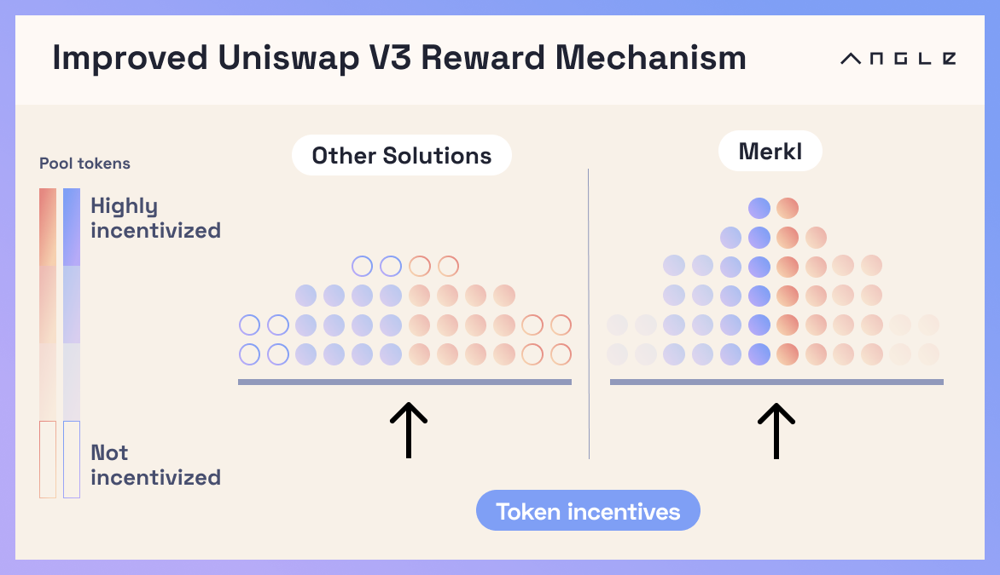
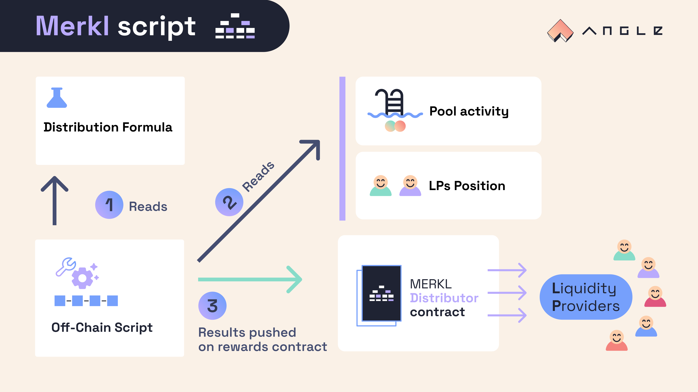

# 🥨 Merkl

Merkl is a mechanism to incentivize Uniswap V3-type liquidity positions in a flexible and efficient way. It is built and maintained by Angle Labs, but is separate from the Angle Protocol.

In essence, Merkl is a platform where Liquidity Providers (LPs) on Uniswap V3 and other types of AMMs with concentrated liquidity can receive compensation from people incentivizing liquidity (incentivizors) on one or several pools.

Incentivizors enjoy **a full flexibility** on how they distribute their incentives: they can choose to reward more heavily LPs who bring more liquidity of one token, or they may prefer to better reward LPs who have set tight ranges and are hence earning more transaction fees from their position. They can also select whether they want to incentivize out of range liquidity or whether they want some holders of a specific token to earn boosted rewards.


Merkl accepts incentives of any ERC-20 token on any pool of the supported AMMs. For the list of chains and AMMs supported by Merkl (along with other info for each chain), check out [this page](helpers.md).


Getting rewarded incurs **no risk of funds** and requires no specific smart contract interactions for LPs: they can retain the custody of their liquidity while still receiving rewards. They can also customize their positions to maximize their earnings from fees and incentives, enjoying all possibilities enabled by concentrated liquidity type of AMMs.

Merkl is compatible with [liquidity position managers](helpers.md) like [Gamma](https://app.gamma.xyz) or [Arrakis](https://www.arrakis.finance). This means that it's possible to provide liquidity via Gamma on a pool and to be rewarded without taking any further action (no need to stake the Gamma or Arrakis token). As such, in the case where there are no other liquidity providers on a pool, using Merkl to incentivize a pool is perfectly equivalent to incentivizing an Arrakis or a Gamma token through a staking contract.

Merkl has a low maintenance fee applied to incentives. Excluding gas when claiming rewards, there is no cost to use the platform for Liquidity Providers.

## ⚙️ Mechanism

Merkl is based on an off-chain script that looks on a given chain into the on-chain data for the pools that are incentivized and computes rewards for all the stakeholders of these pools. Based on this, the script aggregates all reward distribution data in a Merkle tree, then compressed into a Merkle root pushed on-chain to allow LPs to claim their rewards.

The script is ran regularly and for specific periods of time each time. This means that every time the script is ran, it only looks at the on-chain data related specifically to this period of time.

### 💪 Customizable Incentivization Formula

Precisely speaking, for a given pool with two tokens (A and B), the script looks into the swaps that took place on the pool during the period for which it is ran and computes a reward score for each position according to:

- the fees earned by the position during the period, which represent the liquidity of the position used by the pool
- the share of token A held by the position during swaps on the pool
- the share of token B held by the position during swaps on the pool

A different weight, chosen by the incentivizor, is attributed to each parameter. On top of that, incentivizors can further customize the distribution of the rewards for the pool by optionally allowing addresses which hold a specific token (veANGLE or veCRV for example) to earn boosted rewards.

The exact distribution formula for a position in such a pool during a time period is as follows:

$$
[w_{\texttt{fees}} \times \frac{\texttt{fees by position}}{\texttt{fees by pool}}+ w_{\texttt{A}} \times \frac{\texttt{A in position}}{\texttt{A in pool}}+ w_{\texttt{B}} \times \frac{\texttt{B in position}}{\texttt{B in pool}} ] \times \texttt{optional gov token boost}
$$


For big pools with a lot of swaps, the script may not look at data from all the swaps that occured during the given time period, but only sample the biggest of them.


### 🧳 Liquidity Position Managers

As detailed in the introduction, Merkl is compatible with liquidity position managers actively maintaining positions for LPs on concentrated liquidity AMMs. The way the script works for such managers (or wrappers) is that it does not differentiate managers from other "normal" addresses when first computing rewards: it just splits at the end the rewards going to the position manager address proportionally between all its users.

With Merkl, if you incentivize a pool that is compatible with one of the liquidity managers supported by the system, it will most of the time be automatically detected by the script and users indirectly providing liquidity through one such position manager will be able to directly claim their rewards from Merkl contracts.

As the system is off-chain, new types of position managers can easily be added into the system. For instance, it'd be possible to directly reward users of protocols that already use position manager tokens on other contracts (like as a collateral to borrow).


The list of liquidity position managers supported for each AMM and chain can be found on [this page](helpers.md). If you want to add support for a type of liquidity position manager that is not supported or directly reward the underlying users of a smart contract that indirectly controls AMM liquidity, drop a message on the Merkl channel of the [Angle Discord server](https://discord.gg/ByFYzSUt).


Note as well that if there is a liquidity manager or another smart contract which is susceptible to hold some of the LP tokens of the pool you are incentivizing and if this contract is not natively supported by the system then it will be eligible to rewards like any other liquidity provider. If the contract is not able to deal with token rewards (by like forwarding them to another address distributing it to underlying stakeholders), then these rewards may be lost. If rewards sent through Merkl remain unclaimed for a period of more than 1 year (notably because they would go to addresses that cannot claim or deal with them), we reserve the right to recover them and redistribute part of it.

To avoid this kind of situation, the Merkl system lets you blacklist addresses which should be excluded from the reward distribution. If 100 of rewards are distributed, and 10 would have to go to a smart contract of a lending protocol that accepts for instance Gamma tokens as a collateral, and if this type of contract is not yet natively supported by the system, then blacklisting this smart contract allows you to split the 10 of rewards that will normally go to the contract between all the other liquidity providers.

### ⏳ Distribution Epochs

The time periods (also called epochs) over which the script is ran for all the pools of a chain vary depending on the chain. Epoch lengths basically range between 2 hours to 3 days.


Find out the epoch length for each chain [here](helpers.md).


The length of an epoch is also the de facto amount of time between two reward distributions. For instance, if epoch length is 1 day for Ethereum, then Uniswap V3 LPs can claim new rewards at most every day on Merkl.

As the script on which Merkl is based aggregates all the pools on all the supported AMMs for a chain, liquidity providers with liquidity on different pools incentivized across different platforms on the same chain receive their full rewards in just one time at the end of every epoch.

In addition, as the system relies on a single Merkle root to handle distribution per chain, liquidity providers can claim all their token rewards (from potentially different pools on virtually many concentrated-liquidity AMMs) in just one transaction.

Note that the script is compatible with multiple incentivizors incentivizing (with potentially different parameters) LPs of the same pool. If you are only providing liquidity on a single pool, when claiming your rewards, you will claim from all the incentivizors who incentivized the pool.

There is no need for liquidity providers to claim rewards at every epoch. Every Merkle Tree update takes into account the previous state of the reward tree and just adds new rewards on top (which is then reflected in the published Merkle root). Unclaimed rewards for an epoch can be claimed at any time in the future, along with all the rewards distributed in between.

### 🤺 Dispute Periods

The script computing rewards and updating the reward Merkle root on-chain is ran by Angle Labs. It relies on an open source codebase available [here](https://github.com/AngleProtocol/merkl-calculator).

Merkle roots pushed on-chain may be based on off-chain computations, any stakeholder in the ecosystem may fetch on-chain data to run the script and verify the results sent.

Still, to allow anyone to permissionlessly take part in the system and at the same time to reduce the system's exposure to potential hacks or failures, every new Merkle root update is followed by a dispute period which allows anyone to contest the result. A new Merkle root that aggregates reward distribution data for a chain is only effective after this dispute period.

A dispute can be triggered by sending a pre-defined amount of `disputeToken` (most likely agEUR) to the contract distributing rewards. During a dispute, the Merkle root of the distribution contract is frozen to its last valid version. Disputes can then either be considered as valid, in which case the disputer is refunded and the disputed Merkle root is revoked, or invalid. In this last situation, the disputer loses its funds and the dispute period is restarted from scratch (which means the disputed tree is still not considered valid).

Dispute token, amount, and length can be obtained by directly querying the contract handling reward distribution on the chain of interest.

### ⚱️ Fee Structure

Merkl is free to use for liquidity providers claiming rewards. There is a maintenance fee of 3% applied to incentives that are sent by incentivizors.

This fee can be waived for pools which contain some specific approved tokens. In particular, there are no fees for incentives sent to reward pools which have agEUR or another Angle Protocol stablecoin in it.

## Resources

### 📖 Guides

Merkl is a solution any DAO or protocol can use to incentivize liquidity, and any liquidity provider can tap into to earn extra incentives without having to take any action after depositing liquidity.

Pools using Merkl are all listed at [merkl.angle.money](https://merkl.angle.money). Incentives on pools can also be deposited from there.

The system for depositing incentives and claiming rewards **can be easily integrated on any dApp**. [This guide](integration-guide.md) explains among other things how to list the liquidity pools of your choice on your dApp and how to build claim transactions for your users.

If you simply want to use Merkl, check out these guides to [make the best of Merkl as a liquidity provider](lp-guide.md) or to [distribute incentives](incentivizor-guide.md) with the system.

### 🔗 Links

- [Merkl App](https://merkl.angle.money)
- [Smart contracts addresses](helpers.md#smart-contracts)
- [Smart contracts code](https://github.com/AngleProtocol/merkl-contracts)
- [Disclaimer for incentivizors](incentivizor-tc.md)
