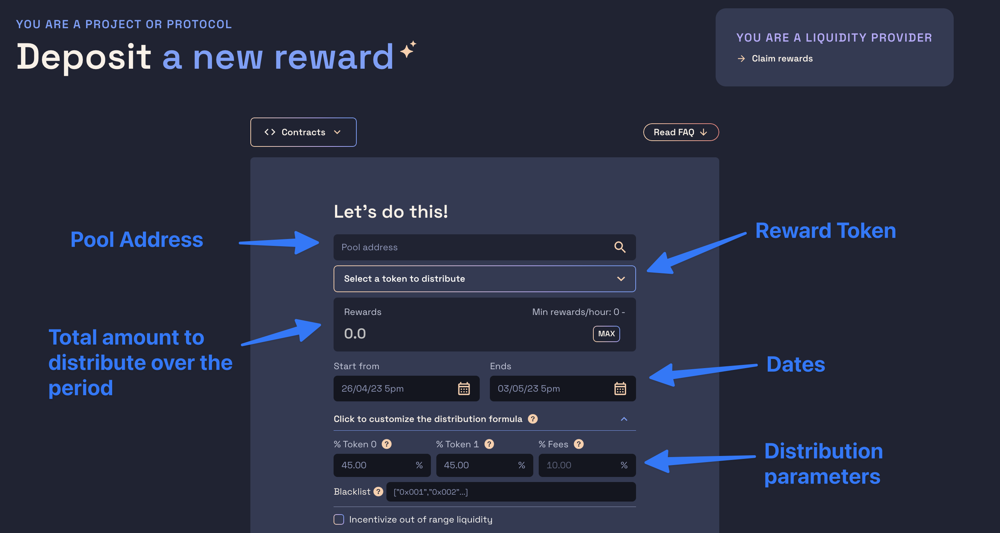
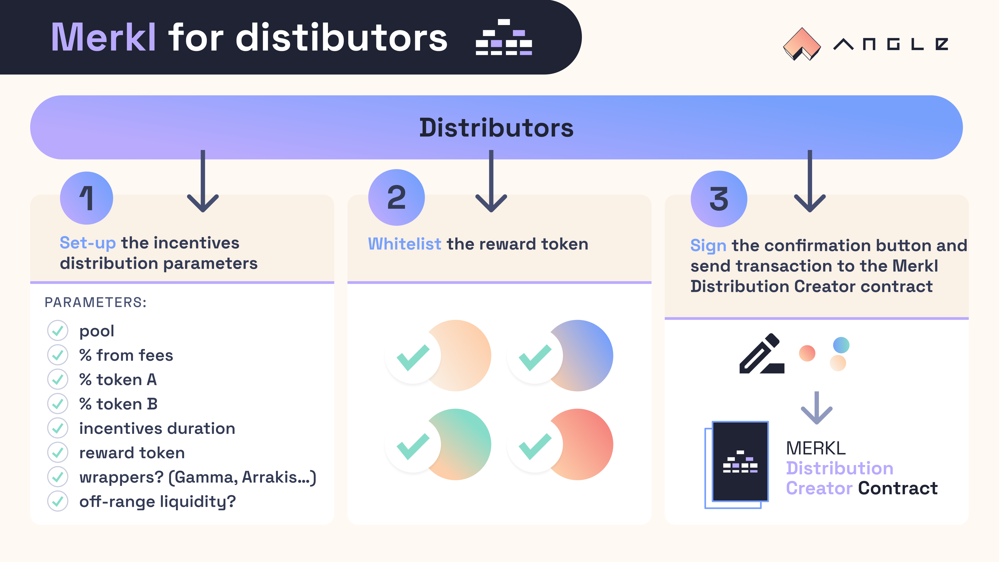

# 💰 Distribute incentives with Merkl

DAOs or individuals looking to incentivize a pool can use Merkl to customize their distribution and get better liquidity.

Incentives distribution can be setup on [this app](https://merkl.angle.money) or directly from the [`DistributionCreator` contract](helpers.md) on the chain of your choice [with a script](#with-a-custom-script) or [from a Gnosis Safe multisig](#from-a-multisig-or-a-gnosis-safe).

Regardless of the method you are using, before depositing any incentives, make sure that:

- You have read the disclaimer for incentivizors. The `DistributionCreator` contract will require you to sign this disclaimer and post your signature onchain. This is a one time requirement that you'll only need to do once when creating your first distribution.
- The token you want to distribute has been whitelisted and the amount per hour of tokens you want to distribute is greater than the minimum amount allowed in the contract (more on this below)
- The AMM you're looking to send incentives to is supported on the chain you want to use


[incentivizor-tc.md](incentivizor-tc.md)



Once created, a distribution on Merkl may take up to 1 hour to be picked up by the Merkl API and front interface. You may track how rewards were distributed to LPs of the pool by checking the [merkl-rewards](https://github.com/AngleProtocol/merkl-rewards) repository which contains the history of rewards given across all distributions across all pools of all supported AMMs.



For more details on how Merkl smart contracts operate, on the list of supported chains, or if you want Merkl to integrate a new chain, a new AMM, or a new liquidity manager, check [this page](./helpers.md)


## 📱 On [merkl.angle.money](https://merkl.angle.money)

You just need to fill the `address` of the pool you want to incentivize, the `total amount` of tokens you want to distribute, and the beginning and end dates of the distribution.




Reward tokens need to be whitelisted before being used, and for whitelisted tokens, there is a minimum amount that needs to be sent for distributions to be considered valid. If the reward token you want to use has not been whitelisted, check [our guide here](helpers.md#add-a-new-reward-token-to-merkl).


If some smart contract addresses need to be excluded from the distribution because they can't claim rewards, make sure to specify their addresses in the `Blacklist`.

Merkl natively and automatically supports different liquidity position managers. LPs can provide liquidity there while being rewarded on Merkl. Note though that supported liquidity position managers (like Gamma or Arrakis) are not available for all pools, so you may want to check which of the supported liquidity position managers are available for your pool.

Then, you can customize any of the distribution formula parameters. When this is done, the app will prompt you to sign the disclaimer message (if it has not already been done), and then to post the transaction sending the tokens to the distribution contract!

Any address holding a position or a position manager token will be able to claim their rewards at the end of each [epoch](helpers.md#🔗-live-amms-and-chains) according to how they provided liquidity on the pool.


Merkl App does not integrate well with smart contract wallets when it comes to providing signatures, so if you're using a smart contract wallet, please refer to the section below. If your address have been whitelist, check out the guide for Gnosis Safe multisig [here below](#if-your-multisig-has-been-whitelisted).




## From a multisig or a Gnosis Safe

The recommended method of interaction to distribute rewards with Merkl with a multisig is to use Gnosis Safe Transaction Builder.

### Signing the Terms & Conditions

Merkl requires people depositing incentives on the system to sign once the T&Cs and post the signature onchain. However, **signing the T&Cs message is not possible with a smart contract wallet** like a Gnosis Safe.

To circumvent this requirement, the Merkl `DistributionCreator` contract checking signatures verifies when a distribution is created that either the `msg.sender` or `tx.origin` of the transaction has signed the T&Cs.

To this extent, when creating a distribution with a multisig, you need to have previously signed the T&Cs with an EOA and posted the signature onchain through the `sign` function of the `DistributionCreator` contract. And then, you need to execute the multisig transaction with the EOA that has posted its signature.

### Building the payload

Now that the signing requirement is clear, what payload should you set in the Gnosis Safe transaction builder?

Below is an example payload with two transactions:

- an approval of the reward token to the Merkl `DistributionCreator` contract
- the transaction to create the distributions with chosen parameters


Merkl Multisig Payload from Gnosis Transaction Builder


The `distribution` tuple given for the `createDistribution` function has the following form:

```json
[
  // Distribution ID: this value must be left as is and cannot be customized
  "0x0000000000000000000000000000000000000000000000000000000000000000",
  // Address of the pool to incentivize
  "0xf44aCAa38be5E965c5Ddf374E7a2BA270e580684",
  // Address of the reward token (here the OP token)
  "0x4200000000000000000000000000000000000042",
  // Total amount of tokens to distribute
  "2000000000000000000000",
  // If any, addresses to blacklist from the distribution
  [],
  // If there are addresses to blacklist, this array should be an array with only 3 in it and of
  // the same length as the array above
  [],
  // Proportion of rewards that'll be split among LPs which brought token0 in the pool during
  // the time of the distribution
  3000,
  // Proportion of rewards that'll be split among LPs which brought token1 in the pool during
  // the time of the distribution
  6000,
  // Proportion of rewards that'll be split among LPs which accumulated fees during the time
  // of the distribution
  1000,
  // Timestamp of the start of the distribution
  1689811200,
  // Number of hours for which the distribution will last once it has started
  168,
  // Whether out of range liquidity should be incentivized
  0,
  // Multiplier provided by the address boosting reward. In the case of a Curve distribution where veCRV
  // provides a 2.5x boost, this would be equal to 25000
  0,
  // Address of the token which dictates who gets boosted rewards or not. This is optional
  // and if the zero address is given no boost will be taken into account
  "0x0000000000000000000000000000000000000000",
  // Additional data to specify for the distribution. This value must be left as is and cannot be customized
  "0x"
]
```

After using the payload provided in example and customizing both the approval and the parameters of the `createDistribution` transaction to fit your needs, you should be ready to execute the transaction to distribute rewards to Merkl!

### If your multisig has been whitelisted

It's possible that addresses are whitelisted so they do not need to post a signature onchain to be able to distribute rewards.
If your multisig address has been whitelisted by Angle Labs, then you can directly interact with Merkl front from your Gnosis Safe.

To do this, head to the Apps section of your multisig, select `My Custom Apps` and then click on `Add custom Safe App`, at which point you can enter for the `Safe App URL` the [Merkl app URL](https://merkl.angle.money/).


Usually, Angle Labs will proceed to whitelisting a multisig if one of the signers of the multisig has posted a signature of the T&Cs onchain on the Merkl contract.


## With a custom script

You do not specifically need to use the Angle frontend interface to reward pools on Merkl: this can directly be done with a transaction at the smart contract level.

The following script shows how to create one or multiple distributions at once on Merkl.

```typescript
import {
  DistributionCreator__factory,
  Erc20__factory,
} from '@angleprotocol/public-sdk'
import { parseEther } from 'ethers/lib/utils'
import { ethers, web3 } from 'hardhat'

async function main() {
  const [deployer] = await ethers.getSigners()
  const ZERO_ADDRESS = ethers.constants.AddressZero
  const MAX_UINT256 = ethers.constants.MaxUint256

  // Address of the reward token to sned
  const rewardTokenAddress = '0x84FB94595f9Aef81147cD4070a1564128A84bb7c'
  // Address of the pool
  const pool = '0x3fa147d6309abeb5c1316f7d8a7d8bd023e0cd80'

  // Same address across all chains
  const distributionCreatorAddress =
    '0x8BB4C975Ff3c250e0ceEA271728547f3802B36Fd'

  const distributionCreator = DistributionCreator__factory.connect(
    distributionCreatorAddress,
    deployer,
  )
  const rewardToken = Erc20__factory.connect(rewardTokenAddress, deployer)

  const params = {
    // Address of the pool to incentivize
    uniV3Pool: pool,
    // Address of the reward token (must be whitelisted)
    rewardToken: rewardTokenAddress,
    // Addresses to exclude from the distribution (or optionally addresses of the wrappers that are not automatically detected
    // by the script)
    positionWrappers: ['0xa29193Af0816D43cF44A3745755BF5f5e2f4F170'],
    // Type of the wrappers (3=blacklisted addresses)
    wrapperTypes: [3],
    // Amount of tokens to send for the WHOLE distribution
    amount: parseEther('350'),
    // Proportion of rewards that'll be split among LPs which brought token0 in the pool during the time
    // of the distribution
    propToken0: 4000,
    // Proportion of rewards that'll be split among LPs which brought token1 in the pool during the time
    // of the distribution
    propToken1: 2000,
    // Proportion of rewards that'll be split among LPs which accumulated fees during the time
    // of the distribution
    propFees: 4000,
    // Whether out of range liquidity should be incentivized
    isOutOfRangeIncentivized: 0,
    // Timestamp of the start of the distribution
    epochStart: 1676649600,
    // Number of hours for which the distribution will last once it has started
    numEpoch: 500,
    // Multiplier provided by the address boosting reward. In the case of a Curve distribution where veCRV
    // provides a 2.5x boost, this would be equal to 25000
    boostedReward: 0,
    // Address of the token which dictates who gets boosted rewards or not. This is optional
    // and if the zero address is given no boost will be taken into account
    boostingAddress: ZERO_ADDRESS,
    // These two parameters are useless when creating a distribution, you may specify here whatever you like
    rewardId: web3.utils.soliditySha3('europtimism') as string,
    additionalData: web3.utils.soliditySha3('europtimism') as string,
  }

  // Comment if you've already approved the contract with `rewardToken`
  console.log('Approving')
  await (
    await rewardToken
      .connect(deployer)
      .approve(distributionCreator.address, MAX_UINT256)
  ).wait()

  /*
  Before depositing a reward, you must make sure that:
  1. Your reward token is whitelisted for the reward distribution and that the per hour distribution amount
  will be higher than the limit
  2. You have read the T&C before signing them
  */

  console.log('Signing the T&C')
  const message = await distributionCreator.message()
  console.log(message)
  const signature = await deployer.signMessage(message)

  console.log('Depositing reward...')
  await (
    await distributionCreator
      .connect(deployer)
      .signAndCreateDistribution(params, signature)
  ).wait()
  console.log('...Deposited reward ✅')

  // Now if you want to create multiple distributions at once, you may also do it as well

  const params1 = {
    uniV3Pool: pool,
    rewardToken: rewardTokenAddress,
    positionWrappers: ['0xa29193Af0816D43cF44A3745755BF5f5e2f4F170'],
    wrapperTypes: [2],
    amount: parseEther('500'),
    propToken0: 4000,
    propToken1: 2000,
    propFees: 4000,
    isOutOfRangeIncentivized: 0,
    epochStart: 1680269613,
    numEpoch: 500,
    boostedReward: 0,
    boostingAddress: ZERO_ADDRESS,
    rewardId: '0x',
    additionalData: '0x',
  }

  const params2 = {
    uniV3Pool: pool,
    rewardToken: rewardTokenAddress,
    positionWrappers: ['0xa29193Af0816D43cF44A3745755BF5f5e2f4F170'],
    wrapperTypes: [2],
    amount: parseEther('750'),
    propToken0: 4000,
    propToken1: 2000,
    propFees: 4000,
    isOutOfRangeIncentivized: 0,
    epochStart: 1681565613,
    numEpoch: 500,
    boostedReward: 0,
    boostingAddress: ZERO_ADDRESS,
    rewardId: '0x',
    additionalData: '0x',
  }

  console.log('Depositing multiple rewards at once...')
  await (
    await distributionCreator
      .connect(deployer)
      .createDistributions([params1, params2])
  ).wait()
  console.log('...Deposited rewards ✅')
}

main().catch((error) => {
  console.error(error)
  process.exit(1)
})
```
