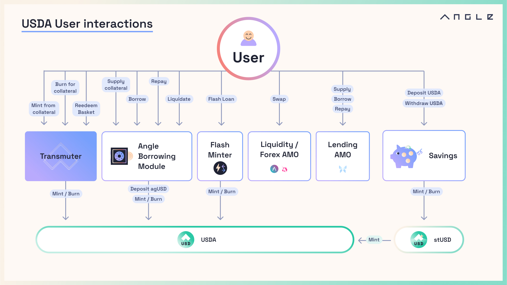

# 🖼 Stablecoins

| Features                                                             | EURA | USDA |
| -------------------------------------------------------------------- | ---- | ---- |
| Transmuter - Ethereum                                                | ✅   | ✅   |
| Savings Solution                                                     | ✅   | ✅   |
| Borrowing Module - Ethereum                                          | ✅   | ❌   |
| Borrowing Module - Polygon                                           | ✅   | ❌   |
| Borrowing Module - Optimism                                          | ✅   | ❌   |
| Borrowing Module - Arbitrum                                          | ✅   | ❌   |
| Flash Loans                                                          | ✅   | ❌   |
| [Bridge Setup](other/cross-chain.md#bridge-solutions) with LayerZero | ✅   | ✅   |
| [Lending Algorithmic Market Operation](other/amo.md)                 | ❌   | ✅   |

[Angle Analytics](https://analytics.angle.money) details in real-time how each module is calibered within each stablecoin.

Depending on the modules in place, the set of user interactions natively available for a stablecoin may vary. A case in point below with USDA:

