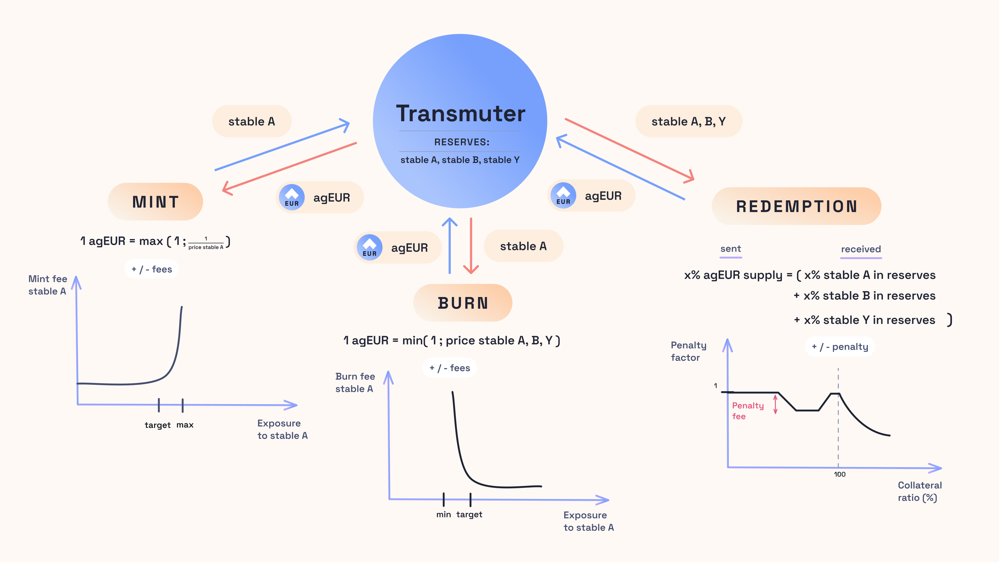

# ⚗️ Transmuter Overview

## 🔭 Introduction

Transmuter is one of the main minting mechanisms for Angle stablecoins. It is conceived as a basket of different assets which can all be used to mint or burn the stablecoin at oracle value.

It comes with automated mechanisms to maintain the exposure to each asset in the reserves within reasonable bounds. This enables the system to properly segregate and diversify the risks between the assets in its backing, and guarantees at the same time that in case of a black swan event the system does not end up over-exposed to the weakest assets of its reserves.

Transmuter supports three main user actions: **Mint, Burn and Redeem**. The mint and burn actions rely on the idea that each asset in the reserves has a target price used to assess whether the asset is depegging and some conservative measure must be taken or not.

Practically speaking, the three operations work as follows:

- [**Mint:**](mintBurn.md) Stablecoins can be minted at oracle value from any of the supported assets with adaptive fees provided that the deviation of the asset used with respect to its target price is reasonable.
- [**Burn:**](mintBurn.md) Stablecoins can be burnt at oracle value for any of the assets in the backing with adaptive fees, provided that the deviation of all assets respective to their target price are reasonable. The idea is to avoid capital outflows changing the exposures of the system in times of uncertainty.
- [**Redeem:**](redeem.md) Stablecoins can be redeemed at any time against a proportional amount of each asset in the backing. Users should have a way to exit at any time, and so this feature is available in any conditions.

## 🏦 Main Properties

Built in the aftermath of the USDC depeg as an improvement over price stability modules for stablecoin protoocols, the Transmuter system is designed with the following key properties:

**Scalability:** Angle Transmuter enables minting and burning with limited fees from a wide range of assets. Its mechanisms work similarly with $1m TVL as with $1bn TVL.

**Resilience:** The underlying mechanisms of the Transmuter system are all fully autonomous and predictable by all types of stakeholders. In case of a black swan event, Transmuter provides reasons to bet on the stablecoin returning to its target price.

**Trustlessness:** Transmuter is able to autonomously withstand unforeseen events, such as collateral depegs or hacks, without requiring any governance intervention.

**Fairness:** There cannot be any bank run as redemptions are thought to break sequentiality between users.

**Robustness:** Transmuter can be used as a basket of different stablecoins or assets allowing collateral risk to be well diversified.

**Safety:** If fees are properly set, the design provides incentives to bring the basket of reserves to a target desired allocation. In case of a depeg, it is unprofitable to perform trades that leave the protocol holding weak assets.

**Gas-efficiency:** Thanks to a range of different optimizations, the system is able to minimize the gas needed to interact with it.

**Modularity:** The system can not only accept any type of asset in the backing, its implementation is such that it can work for any type of stablecoin. On top of that, it is fully compatible with the other protocol's minting modules: it works in parallel with the Angle's Borrowing module, flash-loan systems and direct deposit modules.

## 🤝 Governance

While the main functionalities of the Transmuter system can work autonomously with no governance involved, Transmuter is not a governance-free system.

The protocol governance (and so veANGLE holders) must be involved to add new collateral assets, to adjust the fee parameters that determine the target and maximum exposures to each asset, to change the different oracle parameters, to modify the settings of the redemption curve, or to simply pause minting or burning from an asset.

Governance also has the means to update Transmuter's global accounting and affect the system's collateralization ratio to potentially take into account a profit or a loss made in some other place of the protocol.

## 🕵️ Audits

The smart contracts of the Transmuter have been audited by Code4rena. The code and audits have been published in [our dedicated repository](https://github.com/AngleProtocol/angle-transmuter). They can also be accessed in the [Audits section](../resources/audits/) of this docs.

## 📇 Deployments

Transmuter has been deployed for agEUR on Ethereum at [this address](https://etherscan.io/address/0x00253582b2a3FE112feEC532221d9708c64cEFAb).
