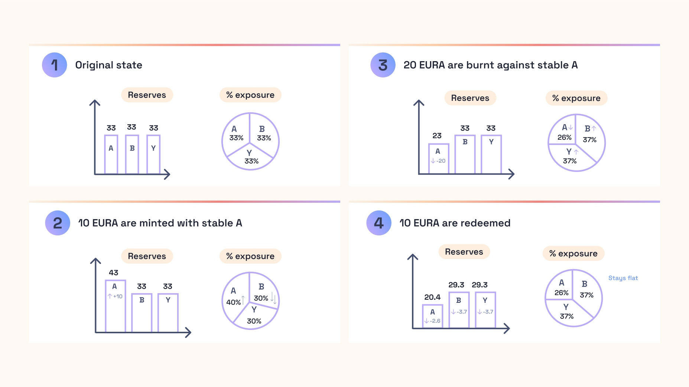

# 💱 Minting and Burning with Transmuter

## 📈 Key Metrics and Quantities

In the Transmuter, it is possible to mint and burn the stablecoin for any of the asset in the collateral at a variable price. On top of the current oracle value $$ p $$ of the asset, the price at which mints or burns happen also depend on whether the asset that is used is currently depegging or not.

Practically, this is done by tracking for each asset in the backing a target price denominated in the stablecoin's base currency. This target value for a collateral can be either absolute or updated relatively frequently. The target value is then used to compute a deviation $$ d $$ which acts as a circuit breaker for mints and burns.

$$ d = \max(1-\frac{p}{\texttt{target price}},0) $$

## 🍀 Mint

The Transmuter enables minting 1 stablecoin against a specific asset $$ i $$ by bringing:

$$ \max(\frac{1}{\texttt{target price}_i},\frac{1}{p_i}) = \frac{d_i}{p_i} + \frac{1}{t_i} $$.

As fees apply, the amount to bring is:

$$ (1+\texttt{fee})(\frac{d_i}{p_i} + \frac{1}{t_i}) $$

This guarantees that if an asset in the backing depegs then it is not profitable to mint with this asset.

Assume for instance that a stablecoin as collateral $$\texttt{EUR}_A$$ trades at0.95€ and there are 0 fees, then $$\frac{1}{0.95}$$ $$\texttt{EUR}_A$$ are needed to get 1 agEUR.

## ➫ Burn

The stablecoin can be burnt for any asset in the backing. Contrarily to the mint case, the price at which the stablecoin is burnt does not only depend on the price of the asset for which it is burnt, it also depends on the price of all the other stablecoins in the backing.

The system looks into the deviation $$d_i$$ for all assets $i$ in the backing with respect to their target price and then applies to the burn price a penalty equal to the largest deviation possible.

The burn price for an asset $$j$$ among $$N$$ assets is then:

$$\frac{1-\max_{i \in N} d_i}{p_j}$$

In its normal state, the stablecoin can be burnt for any of the assets in the system at their fair value which guarantees a small slippage for burning the asset. This system is intended to be the most advantageous burning method if all collateral assets are trading close to their target value.

In case of a depeg of one of the asset in the backing or of a black swan, this mechanism is meant to preserve the system's exposures to all assets. As the stablecoin can be burnt for the same value of assets regardless of the asset it is burnt for, it disincentivizes stablecoin holders from rushing to exit towards the safest asset.

In the example with agEUR, users can burn 1 agEUR and redeem an amount of $$\texttt{EUR}_A$$ equal to:

$$ \frac{1-\max(d*{\texttt{EUR}\_A},d*{\texttt{EUR}_B},d_{\texttt{EUR}_{\texttt{yield}}})}{p_{\texttt{EUR}\_A}}\times(1-\texttt{fee}) $$

Now, consider the case where $\texttt{EUR}_A$ depegs by 5% but not $\texttt{EUR}_B$ or $\texttt{EUR}_{\texttt{yield}}$, then people burning stablecoins can choose to get $1$ $\texttt{EUR}_A$ worth $0.95$\euro{}. They can also choose to get 0.95 $ \texttt{EUR}_B$ worth 0.95€, or 0.95 $\texttt{EUR}_{\texttt{yield}}$ worth 0.95€. In all cases, it's never profitable to burn agEUR for the assets that remain safe in the system.

## 🏭 Transaction Fees

While the values at which mints and burns are happening are one way for the Transmuter system to control the relative exposures to the assets it has in reserves, Transmuter also comes with a variable fee mechanism used for both mint and burn operations.

This mechanism is meant to encourage users to mint or burn for one asset rather than another and hence to enable exposures to each asset to converge to a target window.

Fees when minting from an asset $i$ or burning for an asset $i$ depend on the exposure the system has to this asset, defined as:

$$ \frac{\texttt{stablecoins issued using } i}{\texttt{total stablecoins issued}} $$

Practically, the mint fees can be set to a high value (100%) when the exposure is above a target exposure, while burn fees can be made low in this case. Conversely, when exposure is below the target window, mint fees can be set low and burn fees high so the exposure does not drift below a certain threshold. Note that a [redemption](./redeem.md) does not change the overall system's exposures.

With this, it is still possible that exposures go over the bounds where for instance mint fees reach 100%. Reason is that when you burn for an asset, you're mathematically increasing the exposures to all other assets in the system.

Assume the system is targeting a 40% maximum exposure for a stablecoin $$\texttt{EUR}_A$$, and so far 33 agEUR have been issued with $$\texttt{EUR}_A$$, 33 with another stablecoin $$\texttt{EUR}_B$$ and 33 with $$\texttt{EUR}_{\texttt{yield}} $$, then someone burning 15 agEUR for $$\texttt{EUR}_{\texttt{yield}}$$ $would bring the exposure to $$\texttt{EUR}_A$$ to above 40%. It should be at this point impossible to mint agEUR with $$ \texttt{EUR}_A $$, but burning agEUR for $$\texttt{EUR}_A$\$ should come at a low cost.

In the Transmuter system, there can be negative fees to incentivize people to come with a certain asset. The system however verifies that this does not open arbitrage loops. It is impossible to set negative mint fees if these are in absolute value bigger than the positive burn fees for all the other assets in the system.
