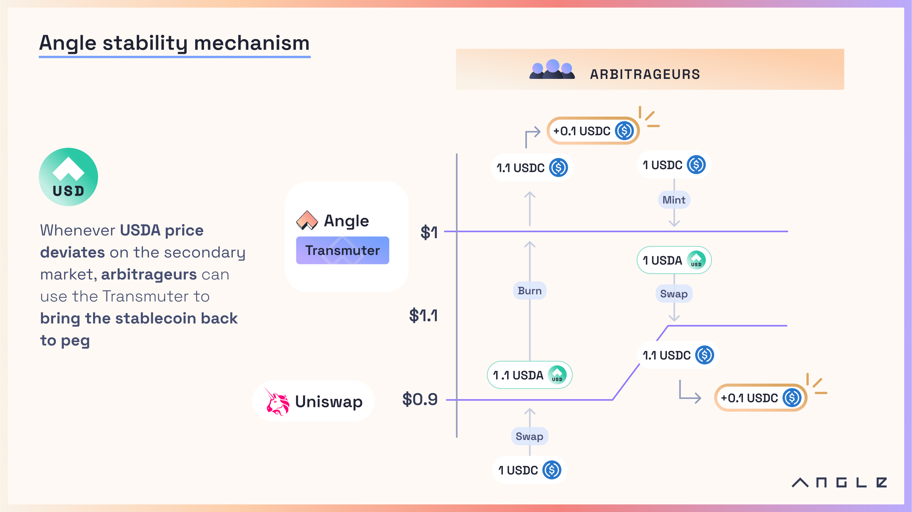
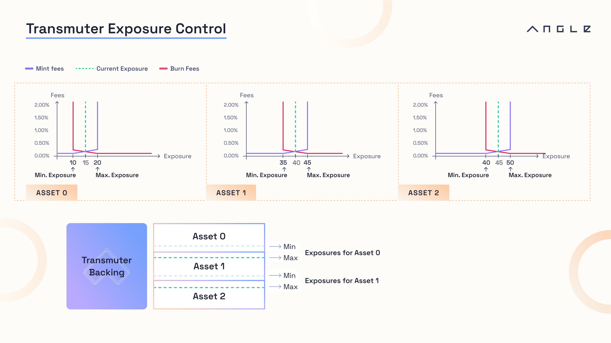
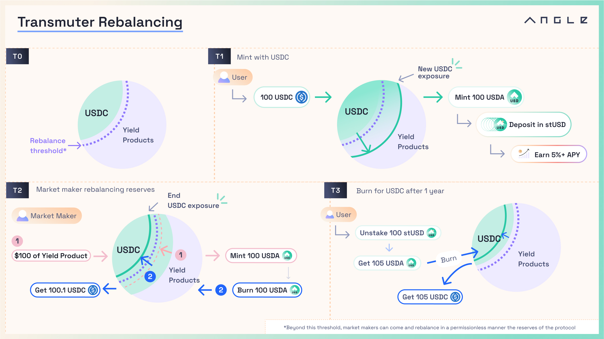

# 💱 Mint and Burn

## 📈 Target Price and Deviation

In the Transmuter, it is possible to mint and burn the stablecoin for any of the asset in the collateral at a variable price. On top of the current oracle value $$p$$ of the asset, the price at which mints or burns happen also depend on whether the asset that is used is currently depegging or not.

Practically, this is done by tracking for each asset in the backing a **target price** denominated in the stablecoin's base currency. This target value for a collateral can be either absolute or updated relatively frequently.

The target value is then used to compute **a deviation** $$d$$ which acts as a circuit breaker for mints and burns:

$$
d = \max(1-\frac{p}{\texttt{target price}},0)
$$


The current oracle value and target price of an asset may be obtained through oracles. Transmuter is agnostic and can technically support any oracle solution, including [Redstone](https://redstone.finance), [Chainlink](https://chain.link) or [Pyth](https://pyth.network) oracles for instance.


## 🍀 Mint

The Transmuter enables minting 1 stablecoin against a specific asset $$i$$ by bringing:

$$
\max(\frac{1}{\texttt{target price}_i},\frac{1}{p_i}) = \frac{d_i}{p_i} + \frac{1}{t_i}
$$

As fees apply, the exact amount to bring is in fact:

$$
(1+\texttt{fee})(\frac{d_i}{p_i} + \frac{1}{t_i})
$$

This guarantees that if an asset in the backing depegs then it is not profitable to mint with this asset.

Assume for instance that a collateral $$\texttt{EUR}_B$$ trades at 0.95€ and there are 0 fees, then $$\frac{1}{0.95}$$ $$\texttt{EUR}_B$$ are needed to get 1 EURA.

## ➫ Burn

The stablecoin can be burnt for any asset in the backing. Contrarily to the mint case, the price at which the stablecoin is burnt does not only depend on the price of the asset for which it is burnt, it also depends on the price of all the other stablecoins in the backing.

For all assets $$i$$ in the backing, the system looks into their deviation $$d_i$$ with respect to their target price and then applies to the burn price a penalty equal to the largest deviation possible.

The burn price for an asset $$j$$ among $$N$$ assets is then:

$$
\frac{1-\max_{i \in N} d_i}{p_j}
$$

In its normal state, the stablecoin can be burnt for any of the assets in the system at their fair value which guarantees a small slippage for burning the asset. But in case of a depeg of one of the asset in the backing, this mechanism is meant to preserve the system's exposures to all assets.

As the stablecoin can be burnt for the same value of assets regardless of the asset it is burnt for, it disincentivizes stablecoin holders from rushing to exit towards the safest asset. In the example with EURA, users can burn 1 EURA and redeem an amount of $$\texttt{EUR}_B$$ equal to:

$$
\frac{1-\max(d_{\texttt{EUR}_B},d_{\texttt{EUR}_C},d_{\texttt{EUR}_{\texttt{yield}}})}{p_{\texttt{EUR}_B}}\times(1-\texttt{fee})
$$

Now, consider the case where $$\texttt{EUR}_B$$ depegs by 5% but not $$\texttt{EUR}_C$$ or $$\texttt{EUR}_{\texttt{yield}}$$, then people burning stablecoins can choose to get 1 $$\texttt{EUR}_B$$ worth 0.95€. They can also choose to get 0.95 $$\texttt{EUR}_C$$ worth 0.95€, or 0.95 $$\texttt{EUR}_{\texttt{yield}}$$ worth 0.95€. In all cases, it's never profitable to burn EURA for the assets that remain safe in the system.


As explained in [this page](implementation/collateralsManagement.md), there can be some collateral assets for which only whitelisted addresses are eligible to burn their stablecoins for it.


The availability of these mint and burn functions allow any arbitrageur to take advantage of price deviations of the stablecoin on the secondary market to bring the stablecoin back to peg.

## 🏭 Exposures and Transaction Fees

While the values at which mints and burns are taking place are one way for the Transmuter system to control its relative exposures to the assets it has in reserves, Transmuter also relies on a variable fee mechanism to enable exposure to each asset to converge to a target area.

Relative exposure to an asset $$i$$ is defined here as:

$$
\frac{\texttt{stablecoins issued using } i}{\texttt{total stablecoins issued}}
$$

Contrarily to the [redemption](redeem.md) case, a mint or a burn for one asset affect the system's exposure to all its backing assets.

And so fees for a mint or burn operation depend on the exposure to the concerned asset after the operation, as a way to prevent the exposure from going beyond certain lower and upper limits.

For instance, mint fees can be set to a high value (100%) when the exposure is above a target exposure, while burn fees can be made low to incentivize reducing the exposure. Conversely, when exposure to an asset is below the target window, mint fees can be set low and burn fees high to incentivize users to increase the system's exposure to this asset.

With this, it is still possible that exposures go over the bounds where for instance mint fees reach 100%. Reason is that when you burn for an asset, you're mathematically increasing the exposures to all other assets in the system.

Assume the system is targeting a 40% maximum exposure for a stablecoin $$\texttt{EUR}_B$$, and so far 33 EURA have been issued with $$\texttt{EUR}_A$$, 33 with another stablecoin $$\texttt{EUR}_C$$ and 33 with $$\texttt{EUR}_{\texttt{yield}}$$, then someone burning 15 EURA for $$\texttt{EUR}_{\texttt{yield}}$$ would bring the exposure to $$\texttt{EUR}_B$$ to above 40%. It should be at this point impossible to mint EURA with $$\texttt{EUR}_B$$, but burning EURA for $$\texttt{EUR}_B$$ should come at a low cost.

In the Transmuter system, there can be **negative fees** to incentivize people to come with a certain asset. The system however verifies that this does not open arbitrage loops. It is impossible to set negative mint fees if these are in absolute value bigger than the positive burn fees for all the other assets in the system.

Below is an example of how a rebalancing operation may look like in the case of USDA:

