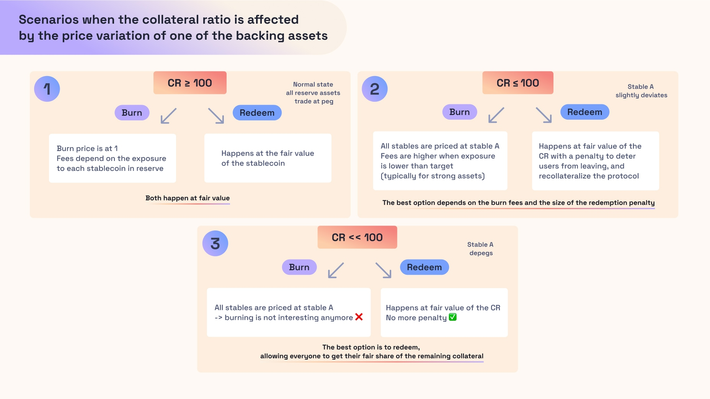

# 🪃 Redeem

## 📚 Principle

Transmuter enables at all times and in any circumstance users to redeem the stablecoin for a proportion of reserve assets minus a fee. This action is meant to be the privileged method of interaction with the protocol during black swan events (like a depeg of one of the stablecoins in the system).

A redemption operation simply consists in exchanging a portion of the stablecoins issued by the system against a portion of the reserves minus a penalty factor that depend on the overall collateral ratio of the system. The amount of what can be redeemed of an asset $$i$$ when redeeming $$\texttt{amount}$$ in the reserves is computed as:

$$
\frac{\texttt{amount}}{\texttt{total stablecoins issued}} \times \texttt{balance}_i \times \texttt{penalty factor}
$$

## 🧮 Penalty Factor Computation

The penalty factor can be set with a peak right when the collateral ratio starts to get inferior to 100%. This is a way to:

- deter users from starting a bank run as they would get less than the fair value of the reserves of the system if redeeming
- reward users who wait for a transitory downturn to pass in a sustainable way.

Users who still want to exit when the protocol gets badly collateralized may still exit, but by doing so they are re-collateralizing the protocol, thus leaving better off the users who remained in the system.

Below a certain level of collateral ratio, the penalty factor can go back to 1. This can be a way to enable all users to exit at the fair value of the reserves when the protocol is in an irremediably bad health.

Note that the reason why the penalty factor curve is hyperbolic when the collateral ratio gets over 100% is to prevent users from redeeming any excess collateral from the protocol.

## 🤔 Example

Consider a state where 100 stablecoins have been issued, and there are 30 $$\texttt{EUR}_B$$, 30 $$\texttt{EUR}_C$$ and 40 $$\texttt{EUR}_{\texttt{yield}}$$ in reserves and $$\texttt{EUR}_B$$ depegs by 5%, the collateral ratio becomes 98.5%. If in this case the penalty is set to be 0.98, a user redeeming 10 EURA gets 2.94 $$\texttt{EUR}_B$$ worth 2.793€, 2.94 $$\texttt{EUR}_C$$ worth 2.94€, and 3.92 $$\texttt{EUR}_{\texttt{yield}}$$ worth 3.92€.

The user got 9.653€ in value, which is actually less than the 9.85€ they should have obtained if they had been settled at the value of the collateral ratio: the protocol is partly re-collateralized by the redemption, and the redemption increased the overall health of the system.

## 🚑 Safety Considerations

In case of a black swan event or a depeg of a stablecoin in the backing, this redemption feature guarantees that all users are treated fairly. The fact that with a redemption the backing decreases in proportion to the reserves and that no governance is needed to activate this feature ensures that there cannot be any form of sequentiality in place where the first arrived for redemptions end up better off than the others. It makes the system highly predictable in the face of downturns and enables every market participant to have a high degree of clarity of what the optimal behavior with respect to the protocol should be. Protocol stakeholders do not have to anticipate what would be the outcome of governance decisions and how they should position themselves in the wake of a depeg of a reserve asset regarding a potential settlement.


As explained in [this page](implementation/collateralsManagement.md), there can be some configurations where the system supports restricted assets in reserves and in which only whitelisted addresses are eligible to receive a proportion of ALL collateral assets when redeeming.


Note that Transmuter could just work with the mint and redemption functionalities. The burn function is more to be seen as a UX facilitator for users who do not want to end up with a multitude of tokens when redeeming. In most circumstances, and when exposures to different assets are close to their targets, the protocol is better off with users redeeming rather than burning for one asset. To this extent, the redemption method should be the cheapest and the privileged method of interaction for advanced traders who can handle multiple tokens at once.

The figure below shows the effect of burning with respect to redeeming in different collateral ratio settings:

