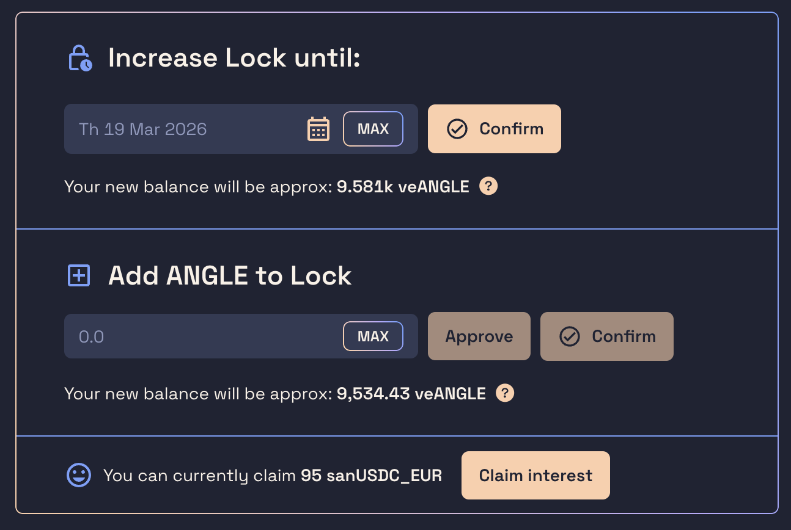

# 🔒 Lock ANGLE tokens

ANGLE holders can lock their [ANGLE tokens](https://blog.angle.money/angle-token-explained-voting-power-incentives-and-benefits) between 1 week and 4 years to obtain veANGLE, granting them voting power in our governance system and a share of the interest generated by the protocol.

Before locking ANGLE, make sure you read all the details about veANGLE and locking [here](../governance/veANGLE/). Remember that the veANGLE tokens you'll get are non-transferable (you won't be able to sell it) and that you will not be able to get back your ANGLE tokens during the period for which you have locked them.


You can get ANGLE tokens by buying them from any other crypto-asset on [this page](https://app.angle.money/buy) of the app.


ANGLE tokens can be locked on the [Lock page](https://app.angle.money/lock).

<figure><figcaption></figcaption></figure>

## Creating a lock

To create a lock, enter an amount of tokens to be locked and an expiration date.

The more ANGLE you lock and the longer you lock them, the bigger your veANGLE balance will be, and hence the bigger your influence in the Angle protocol.

Then, two transactions are needed:

1. First transaction is to approve the contract. This transaction is needed to allow the veANGLE contract to use your ANGLE tokens.
2. Second transaction is to create the lock with the specified amount of tokens and the desired duration.

After executing this, you'll be owning veANGLE tokens. Your veANGLE balance will decrease over time to go to 0 when your lock is expired.


You will only be able to create a lock with your address once. Once an address initiates a lock, it can only increase the lock expiration, or add tokens to the lock.


## Increasing the lock or adding tokens

Once your lock has been created, to extend the lock expiration or add tokens, just click on one of the two buttons and choose a new expiration date (up to 4 years from now) or a quantity of tokens to add.

## Expired lock

Once your lock is expired, to get your ANGLE tokens back from the lock, you need to execute a transaction. This can be done by clicking on the `Withdraw ANGLE` button that'll be visible at this time on the [lock page](https://app.angle.money/lock) of the app.
