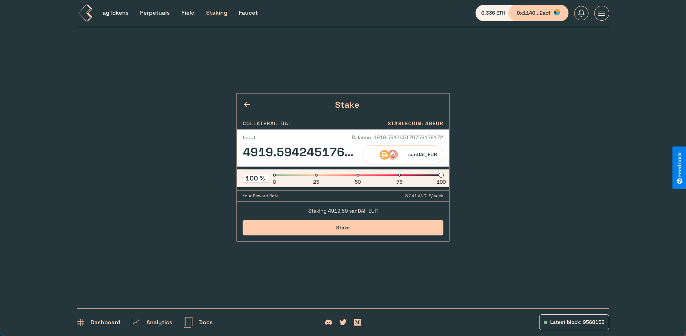
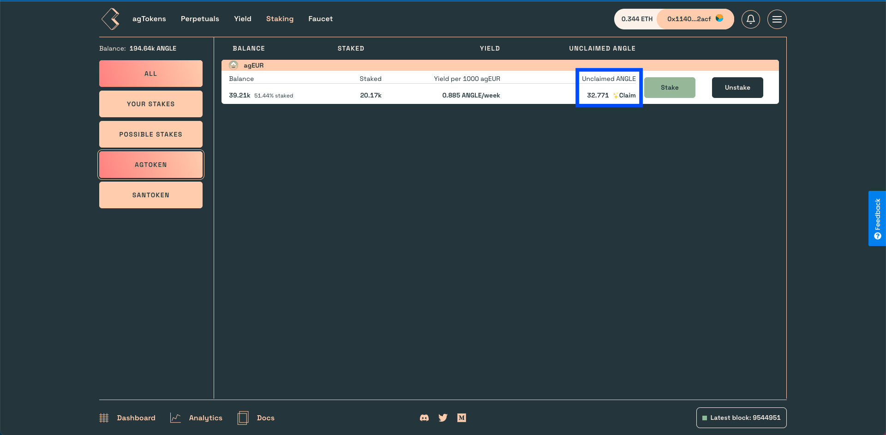
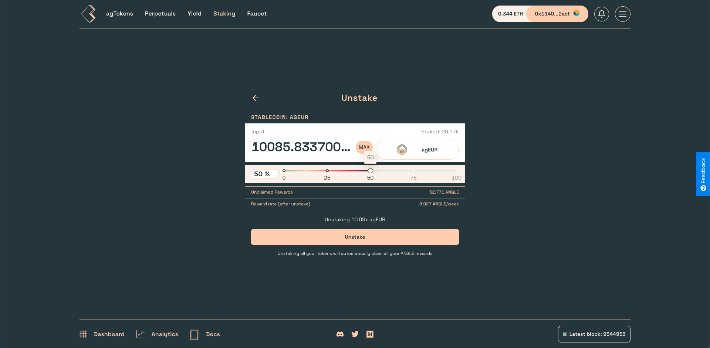

# Staking Pools

You can stake your sanTokens and agTokens in the staking page to earn ANGLE rewards.

The weights of rewards distribution between pools is updated weekly by governance. You can find more information about the tokenomics [here in the docs](../governance/angle-token/README.md), or in [this blog post](https://blog.angle.money/angle-protocol-tokenomics-29ea8b7bf001).

On the main Staking page, you can choose to `Stake` your tokens, `Claim` your rewards, or `Unstake` your tokens (which will claim rewards simultaneously if you unstake everything you staked).

You need to have either agTokens or sanTokens to be able to stake withing Angle.

## Stake

To **stake**, you simply need to click on the `Staking` button and enter the amount of tokens you want to stake.

## Claim

To **claim** your rewards, click on the `Claim` button on the main Staking page. This will prompt you the transaction to claim all your rewards.

## Unstake

To **unstake** your tokens, you can click on the `Unstake` button. This will redirect you to another page asking you for the number of tokens you want to unstake.

