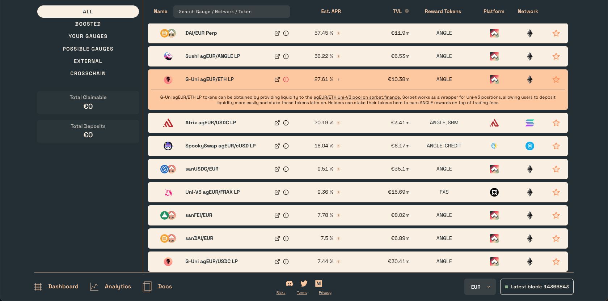

# Earning ANGLE rewards

To earn ANGLE distributed as part of the weekly emissions, users can deposit sanTokens, open long positions on the protocol with Perps, or deposit LP (liquidity providers) tokens. 

You can find all the available pools in the [Incentives page](https://dao.angle.money/#/stake) of the DAO App. 

After staking your tokens, you will start accruing ANGLE. You can claim your tokens from each card, or from the `Claim Rewards` button on your left to claim all rewards from Perps and boosted gauges in one transaction. 

## Claim and Add to lock
After clicking on the `Claim Rewards` button, you have an option to claim your ANGLE rewards and add them to your lock if you have one. This will automatically lock your ANGLE for the remaining time of your lock, and increase your veANGLE balance.  

