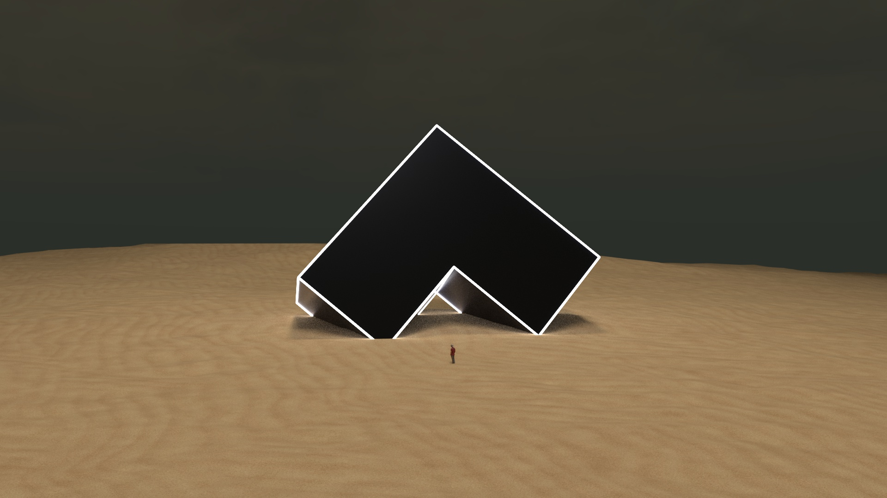

# 📖 Whitepaper

The whitepaper contains a detailed and technical description of Angle's protocol.


Angle Whitepaper



The whitepaper is a static document explaining the concept and inspiration for the first version of the protocol. The up-to-date source of truth for Angle Protocol functionality and contracts is this documentation guide.



If there is anything unclear or out of date or feel like you have feedbacks on the protocol, please do not hesitate to let us know on Angle community [Discord server](https://discord.gg/67WSSZqBG6) 🕹️. This is the place where we collectively play, exchange, improve, and help build the best protocol possible!


